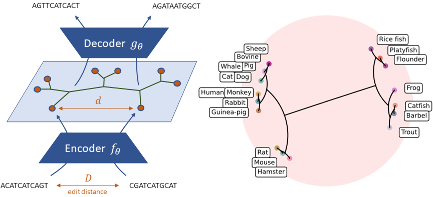

# Neural Distance Embeddings for Biological Sequences

Official implementation of Neural Distance Embeddings for Biological Sequences (NeuroSEED) in PyTorch. NeuroSEED is a novel framework to embed biological sequences in geometric vector spaces. Preprint will we published soon.



## Overview

The repository is organised in four main folders one for each of the tasks analysed. Each of these contain scripts and models used for the task as well as instructions on how to run them and the tuned hyperparameters found. 

- `edit_distance` for the *edit distance approximation* task
- `closest_string` for the *closest string retrieval* task
- `hierarchical_clustering` for the *hierarchical clustering* task, further divided in `relaxed` and `unsupervised` for the two approaches explored
- `multiple_alignment` for the *multiple sequence alignment* task, further divided in `guide_tree` and `steiner_string`
- `util` contains a series of utility routines shared between all the tasks
- `tests` contains a wide range of tests for the various components of the repository 

## Installation

Create a virtual (or conda) environment and install the dependencies:

```
python3 -m venv neuroseed
source neuroseed/bin/activate
pip install -r requirements.txt
```

Then install the `mst` and `unionfind` packages used for the hierarchical clustering:

```
cd hierarchical_clustering/relaxed/mst; python setup.py build_ext --inplace; cd ../../..
cd hierarchical_clustering/relaxed/unionfind; python setup.py build_ext --inplace; cd ../../..
```


## License

MIT

